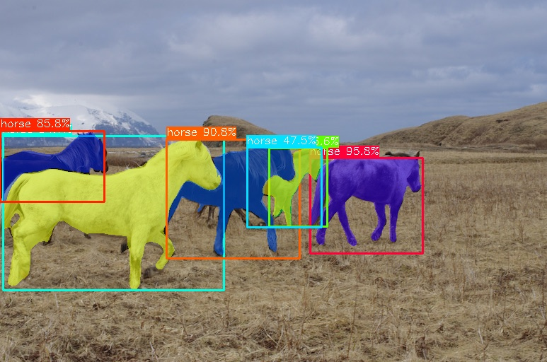

# yolov7-mask-ncnn

```
mkdir build
cd build 
cmake ..
make 
./yolov7_mask_ncnn ../imgs/horses.jpg
```

## screenshot


## reference  
https://github.com/Tencent/ncnn  
https://github.com/WongKinYiu/yolov7/tree/mask  
https://github.com/pytorch/vision
